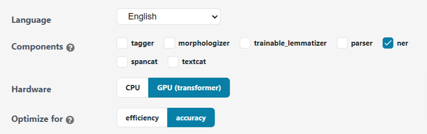
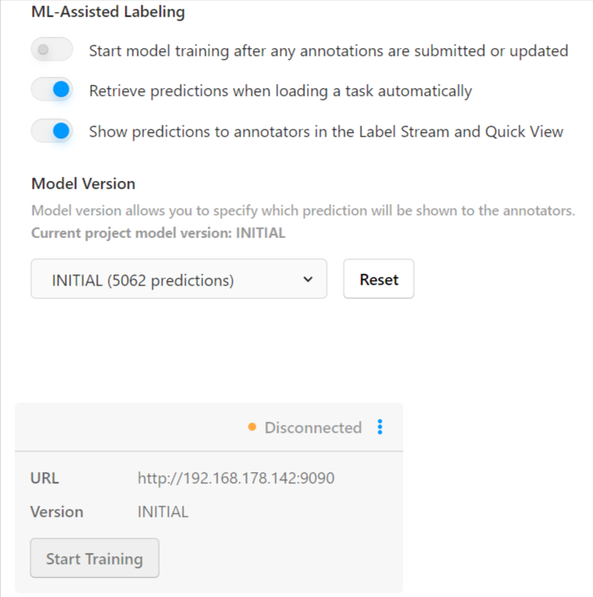

# Crypto NER

A brief description of what this project does and who it's for

## Screenshots

## 1. Collecting Data via API 
To collect the data, the repository includes a docker ready programm to fetch data from the free CryptoPanic API. Include your own Authcode that you can get here: [CryptoPanic API](https://cryptopanic.com/developers/api/keys/)

The data is than store in a MongoDB. You can create a free MongoDB, or use your own database. To create a free MongoDB in the cloud, click here: [MongoDB](https://www.mongodb.com/)

*Hint: I used Google Jobs to fetch the data from the API and store it in a MongoDB on a regular basis. For this I let Google Jobs execute the CollectData Docker every hour.*

## 2. Download Data and Prepare for Labelling
The database contains headlines from German- and English-language newspapers. Therefore, the data must be divided into two different data groups during the download. In the next step, all data irrelevant for the annotation process can be removed from the table.

[LabelStudio](https://labelstud.io/) was used to annotate the headlines. Three labels were chosen, to be seen in the picture below.
1. Person
2. Organisation
3. Cryptocurrency

The labelled data was exported as a .conll (CONLL2003) file. 

## 3. Setup spaCy Pipeline
For a basic Named Entity Recognition Model you can use the [Quickstart Tool](https://spacy.io/usage/training#quickstart) from spaCy, which creates a config file according to your selections. If you decide to use the GPU, the config file will include Transformers in the Pipeline. Use [Kaggle](https://www.kaggle.com/) or [Google Colab](https://colab.research.google.com/) to train the model with free GPU instances. When you want to train locally, you need a Nvidia GPU with cuda installed and the fitting pytorch and spacy+spacy-transformers library. [Check out spaCy instructions for that](https://spacy.io/usage).

## 4. Train spaCy Model
To train the model you need to convert the .conll file with the labelled data into .spacy files:
- <code>spacy convert input.conll -c conll ./output_directory/</code>

Hint

In my setup it was necessary to edit the headline of the .conll file from LabelStuduio in orderto convert it to .spacy via the spaCy CLI.
- Add a O to the existing Headline in the .conll file 
-DOCSTART- -X- O 
to 
-DOCSTART- -X- O O

 
In the next step initialise the config file from the pipeline selection step:

- <code>python -m spacy init fill-config base_config.cfg config.cfg</code>

Now you can already start training your Crypto NER Model based on the labelled data:
- <code>python -m spacy train config.cfg --output ./output --paths.train ./train.spacy --paths.dev ./dev.spacy</code>

Hint

- If you have selected the GPU in the pipeline selection process, add <code>--gpu-id 0</code> to the end of the command above.
  
- If you are training your model on Google Colab or Kaggle, make sure the GPUs are activated. 

  
###5. (Optional) Use Trained Model for Automatic Pre-Labelling in LabelStudio
If you have used the above commands, your trained model will be saved in the /output folder. 
You can now use this model to automatically pre-label additional data to increase the amount of labelled data. You then only need to check that the pre-labelled data is labelled correctly, which speeds up the labelling process considerably.

For that you can register a ML Backend in the LabelStudio Settings:

LabelStudio Machine Learning Backend

In order to setup a ML backend that you can add in the LabelStudio Backend, you have to setup a ml backend service. For that, check out the following repository: [label-studio-ml-backend](https://github.com/heartexlabs/label-studio-ml-backend)

## 6. Benchmark, Testing and Results

##### 1. Benchmark - Wandb.ai
I used [wandb.ai](https://wandb.ai/) to track the training of my NER model. Wandb has to be included into your .config file. 

training.logger

<code>
[training.logger]

#@loggers = "spacy.ConsoleLogger.v1"
#progress_bar = false
@loggers = "spacy.WandbLogger.v3"
project_name = "crypto-ner-ml-monitor"
remove_config_values = ["paths.train", "paths.dev", "corpora.train.path","corpora.dev.path"]
log_dataset_dir = "/kaggle/working/corpus"
model_log_interval = 1000</code>

 </>

In addition you also have to create an account and install the library in your environment and connect to wandb.ai using your AuthCode. 
[See documentation...](https://docs.wandb.ai/quickstart)

Hint for Kaggle

In Kaggle it is not possible to enter the Authcode for wandb.ai into the CLI. You can use the Secrets Add-on and insert the keylike this:

<code>from kaggle_secrets import UserSecretsClient
import wandb
user_secrets = UserSecretsClient()
wandb_api = user_secrets.get_secret("CryptoNer") 
wandb.login(key=wandb_api)</code>

Results from Wandb:

## Precision

## F-Score

## Recall

##### 2. Testing - Wandb.ai